<!-- Animated Header Banner -->

<!-- Typing SVG -->

 

<!-- Profile Views + GitHub Followers -->

---

## About Me

Software Developer with 7 years of experience in software development and 12 years in IT.

Bachelor’s Degree in Systems Analysis and Development.

Postgraduate Degree in Software Architecture and Solutions.

Goiás, Brazil.

---

##  Architecture Mindset

```mermaid
graph TD
    A(["Alessandro Mota"]) --> B["Frontend"]
    A --> C["Backend"]
    A --> D["Infrastructure"]

    B --> B1["Angular 14+"]
    B --> B2["React / React Native"]
    B --> B3["TypeScript · Tailwind CSS"]

    C --> C1["ASP.NET Core"]
    C --> C2["REST APIs · RabbitMQ · Redis"]
    C --> C3["PostgreSQL · SQL Server"]

    D --> D1["AWS (EC2 · S3 · RDS · Fargate)"]
    D --> D2["Docker · Azure DevOps"]
    D --> D3["Google Cloud · OAuth2"]

    style A fill:#00ff41,color:#000,stroke:#00b300,stroke-width:2px
    style B fill:#003300,color:#a8ff78,stroke:#00ff41
    style C fill:#003300,color:#a8ff78,stroke:#00ff41
    style D fill:#003300,color:#a8ff78,stroke:#00ff41
    style B1 fill:#0d1117,color:#ffffff,stroke:#00ff41
    style B2 fill:#0d1117,color:#ffffff,stroke:#00ff41
    style B3 fill:#0d1117,color:#ffffff,stroke:#00ff41
    style C1 fill:#0d1117,color:#ffffff,stroke:#00ff41
    style C2 fill:#0d1117,color:#ffffff,stroke:#00ff41
    style C3 fill:#0d1117,color:#ffffff,stroke:#00ff41
    style D1 fill:#0d1117,color:#ffffff,stroke:#00ff41
    style D2 fill:#0d1117,color:#ffffff,stroke:#00ff41
    style D3 fill:#0d1117,color:#ffffff,stroke:#00ff41
```

---

## Tech Stack

### Frontend

  
  
  
  
  
  
  
  

### Backend

  
  
  
  
  
  

### DevOps & Cloud

  
  
  
  
  

---

## GitHub Stats

  

## Contribution Graph

  

---

## Connect

  

 

  

